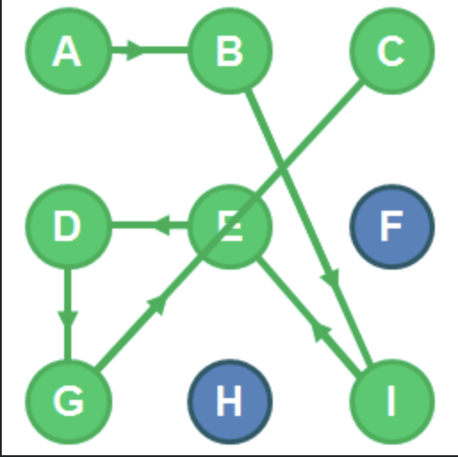

# Screen locking patterns

You might already be familiar with many smartphones that allow you to use a geometric pattern as a security measure. To unlock the device, you need to connect a sequence of dots/points in a grid by swiping your finger without lifting it as you trace the pattern through the screen.

The image below has an example pattern of 7 dots/points:



```Markdown
(A -> B -> I -> E -> D -> G -> C).
```

For this kata, your job is to implement a function that returns the number of possible patterns starting from a given first point, that have a given length.

More specifically, for a function `countPatternsFrom(firstPoint, length)`, the parameter firstPoint is a single-character string corresponding to the point in the grid (e.g.: 'A') where your patterns start, and the parameter length is an integer indicating the number of points (length) every pattern must have.

For example, `countPatternsFrom("C", 2)`, should return the number of patterns starting from 'C' that have 2 two points. The return value in this case would be 5, because there are 5 possible patterns:

```Markdown
(C -> B), (C -> D), (C -> E), (C -> F) and (C -> H).
```

Bear in mind that this kata requires returning the number of patterns, not the patterns themselves, so you only need to count them. Also, the name of the function might be different depending on the programming language used, but the idea remains the same.

## Rules

- In a pattern, the dots/points cannot be repeated: they can only be used once, at most.

- In a pattern, any two subsequent dots/points can only be connected with direct straight lines in either of these ways:
  - Horizontally: like (A -> B) in the example pattern image.
  - Vertically: like (D -> G) in the example pattern image.
  - Diagonally: like (I -> E), as well as (B -> I), in the example pattern image.
  - Passing over a point between them that has already been 'used': like (G -> C) passing over E, in the example pattern image.

This is the trickiest rule. - Normally, you wouldn't be able to connect G to C, because E is between them, however when E has already been used as part the pattern you are tracing, you can connect G to C passing over E, because E is ignored, as it was already used once.

The sample tests have some examples of the number of combinations for some cases to help you check your code.

Haskell Note: A data type Vertex is provided in place of the single-character strings. See the solution setup code for more details.

## Fun fact

In case you're wondering out of curiosity, for the Android lock screen, the valid patterns must have between 4 and 9 dots/points. There are 389112 possible valid patterns in total; that is, patterns with a length between 4 and 9 dots/points.
